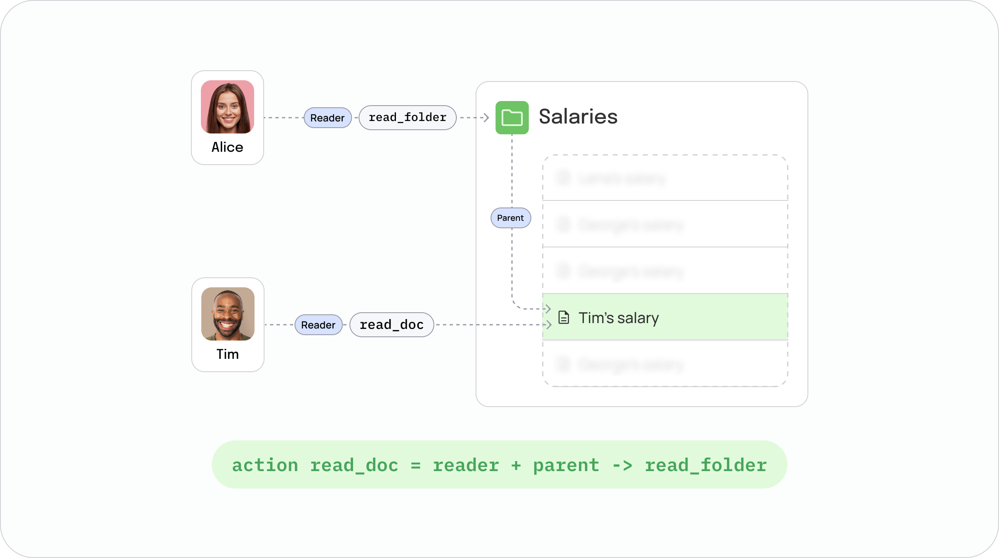

## Installation

1. [Docker Desktop](https://docs.docker.com/desktop/)

2. [zed cli](https://authzed.com/docs/spicedb/getting-started/installing-zed)

## Setup

This folder is a **standalone demo app** — it is not installed by `yarn` or `npm` at the repo root. From this directory:

```bash
cd examples
yarn install   # or: npm install
docker compose -f docker-compose.sync.yml up -d
zed import ./schema-relationships.yaml --insecure --endpoint localhost:50051 --token spicedb
```

## Authorization model

[`schema-relationships.yaml`](./schema-relationships.yaml) defines **two independent models** on the same SpiceDB engine: a document/folder ReBAC graph for FGA lookups, and a Frontegg feature/tenant graph for entitlement lookups.

### Schema overview

| Definition | Relations | Permission | Purpose |
| --- | --- | --- | --- |
| `user` | — | — | Subject in FGA checks (`entityType: 'user'`) |
| `folder` | `reader → user` | `read_folder = reader` | Shared container (e.g. payroll folder) |
| `document` | `parent → folder`, `reader → user` | `read_doc = parent→read_folder + reader` | A file; access via direct grant **or** inherited from folder |
| `frontegg_user` | — | — | Subject in feature checks (`userId`) |
| `frontegg_tenant` | `member → frontegg_user` | `access = member` | Tenant membership |
| `frontegg_feature` | `granted → frontegg_user \| frontegg_tenant` | `access = granted` | Product feature flag |

Both models use **caveats** (SpiceDB conditional tuples):

- **`active_at`** — relationship is valid only between `activeFrom` and `activeUntil`. Used on document/folder tuples and evaluated with the `at` query parameter.
- **`targeting`** — feature grant is valid when `expiration >= now` and optional targeting rules match `user_context`. Demo tuples use empty rules and a far-future expiration.

### Relationship tuples (plain English)

After `zed import`, SpiceDB holds these tuples (IDs shown decoded; the YAML stores them base64-encoded):

**Payroll documents (FGA)**

| Tuple | Meaning |
| --- | --- |
| `folder:salaries#reader@user:Alice` | Alice can always read the salaries folder |
| `document:Tim's_salary_Jan#reader@user:Tim` | Tim is direct reader from **2026-01-01** |
| `document:Tim's_salary_feb#reader@user:Tim` | Tim is direct reader from **2026-02-01** |
| `document:Tim's_salary_mar#reader@user:Tim` | Tim is direct reader from **2026-03-01** |
| `document:Tim's_salary_*#parent@folder:salaries` | Each salary doc lives under `salaries`, with the **same** `activeFrom` as Tim's direct reader tuple |

**Feature entitlements (Frontegg)**

| Tuple | Meaning |
| --- | --- |
| `frontegg_tenant:demo-tenant#member@frontegg_user:Tim` | Tim belongs to tenant `demo-tenant` |
| `frontegg_feature:basic#granted@frontegg_tenant:demo-tenant` | Tenant gets the `basic` feature |
| `frontegg_feature:premium#granted@frontegg_user:Tim` | Tim gets `premium` directly (not via tenant) |

### How permission flows



```text
Document access (read_doc = parent->read_folder + reader)

Alice --folder reader--> salaries folder
                           |
                           | parent active_at
                           +--> Tim salary Jan (active from 2026-01-01)
                           +--> Tim salary Feb (active from 2026-02-01)
                           +--> Tim salary Mar (active from 2026-03-01)

Tim --direct reader + active_at--> Tim salary Jan (active from 2026-01-01)
Tim --direct reader + active_at--> Tim salary Feb (active from 2026-02-01)
Tim --direct reader + active_at--> Tim salary Mar (active from 2026-03-01)

Feature access (access = granted)

Tim (frontegg_user) --member--> demo-tenant (frontegg_tenant)
demo-tenant --granted + targeting--> basic feature
Tim (frontegg_user) --granted + targeting--> premium feature
```

**Document `read_doc`** is granted if **either** path succeeds at the requested time (`at`):

1. **Direct** — subject is `document#reader` and the tuple's `active_at` caveat passes.
2. **Inherited** — subject is `folder#reader` on the document's `parent` folder, and **both** the `parent` and `reader` caveats pass.

Examples the demos rely on:

- **Tim @ 2026-01-01** on `Tim's_salary_Jan` → allowed (direct reader active).
- **Tim @ 2026-01-01** on `Tim's_salary_feb` → denied (`activeFrom` is 2026-02-01).
- **Alice @ 2026-02-01** on `Tim's_salary_Jan` → allowed (folder reader + parent link active; no direct reader needed).

**Feature `access`** for subject `{ tenantId: 'demo-tenant', userId: 'Tim' }`:

- `basic` — via tenant grant (`Tim` → member → tenant → granted).
- `premium` — via direct user grant.
- Unknown users in the tenant → no features.

## Running Examples

All demos are defined as scripts in [`package.json`](./package.json). From the `examples` directory, run any script with your package manager:

```bash
yarn demo:alice
# or
npm run demo:alice
```

| Script | Source folder | Model | What it exercises |
| --- | --- | --- | --- |
| `demo:alice` | `1. is-entitled-demo-alice-inheritance/` | FGA documents | Alice inherits folder access through `parent→read_folder` |
| `demo:tim` | `2. is-entitled-demo-tim-direct/` | FGA + features | Time-gated `read_doc` and batch feature checks |
| `demo:lookup-targets` | `3. lookupTargetEntities-demo/` | FGA documents | `lookupTargetEntities` — which docs Tim can read at a given `at` |
| `demo:lookup-entities` | `4. lookupEntities-demo/` | FGA documents | `lookupEntities` — who can read a given doc |
| `demo:lookup-entitlements` | `5. lookupEntitlements-demo/` | Frontegg features | `lookupEntitlements` — effective features for tenant vs user |

`demo:tim` is also the default when you run `yarn start` or `npm start`.
